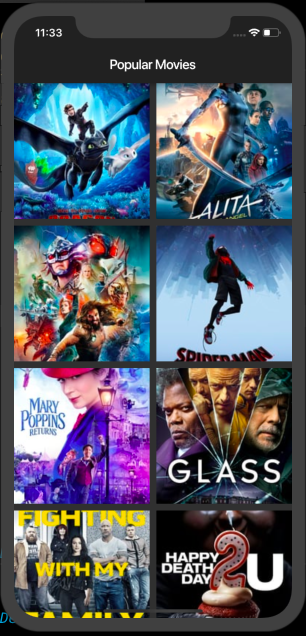
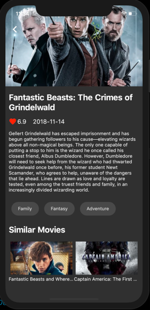

# Fluttery Movies

Movies app 🎥 which is developed using Flutter and powered by tmdb api. It follows bloc architecture pattern and Inherited Widget.
This project was made for learning the bloc architecture pattern and Inherited Widget. 


# Screenshot

| Movie List Screen | Movie Detail Screen |
| ------------------ | ------------------ |
|   |   |

 


## How to Contribute
1. Fork the the project
2. Create your feature branch (git checkout -b my-new-feature)
3. Make required changes and commit (git commit -am 'Add some feature')
4. Push to the branch (git push origin my-new-feature)
5. Create new Pull Request

## Getting Started

For help getting started with Flutter, view online
[documentation](https://flutter.dev/).

#### 1. [Setup Flutter](https://flutter.dev/setup/)

#### 2. Clone the repo

```sh
$ git clone https://github.com/ZeynelErdiKarabulut/Flutter-Movies-Sample.git
$ cd Flutter-Movies/
```

#### 4. Run the app

```sh
$ flutter run
```

